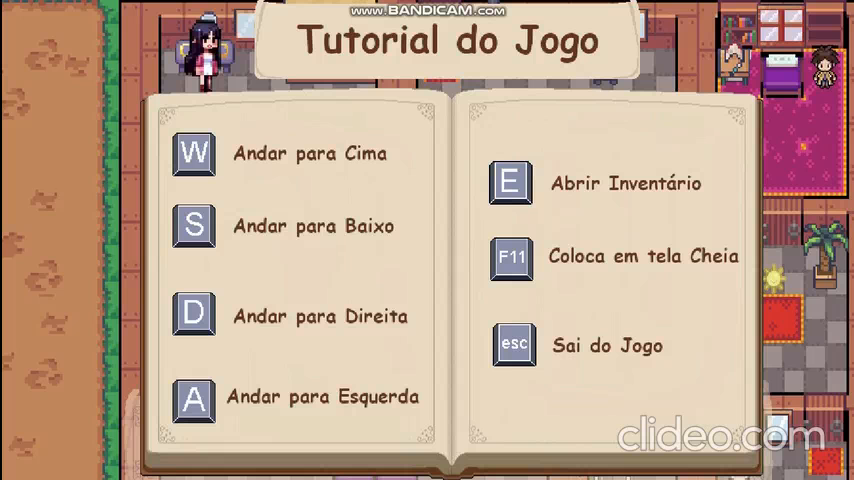
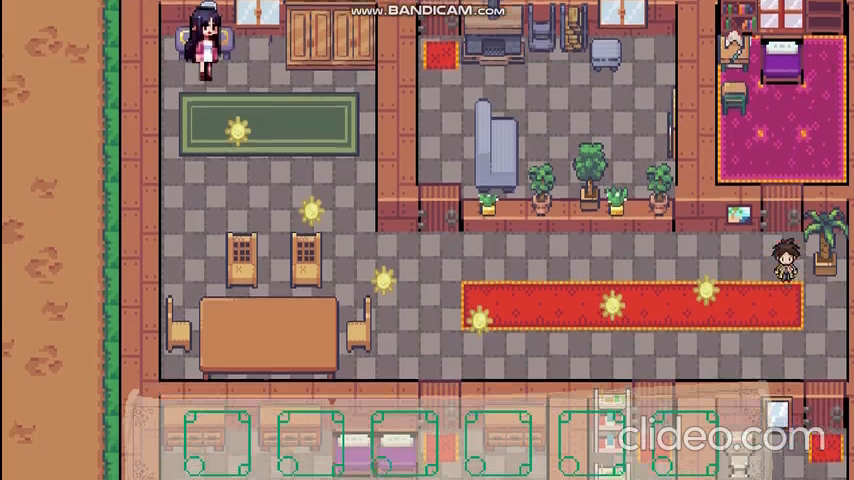
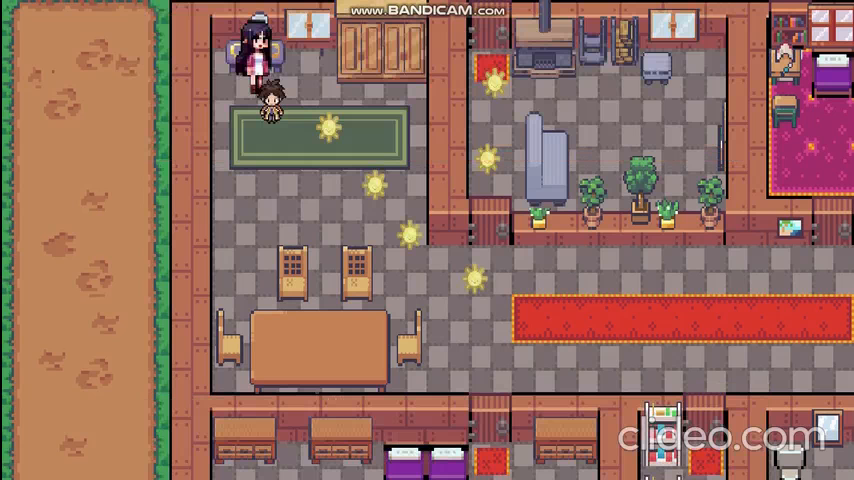
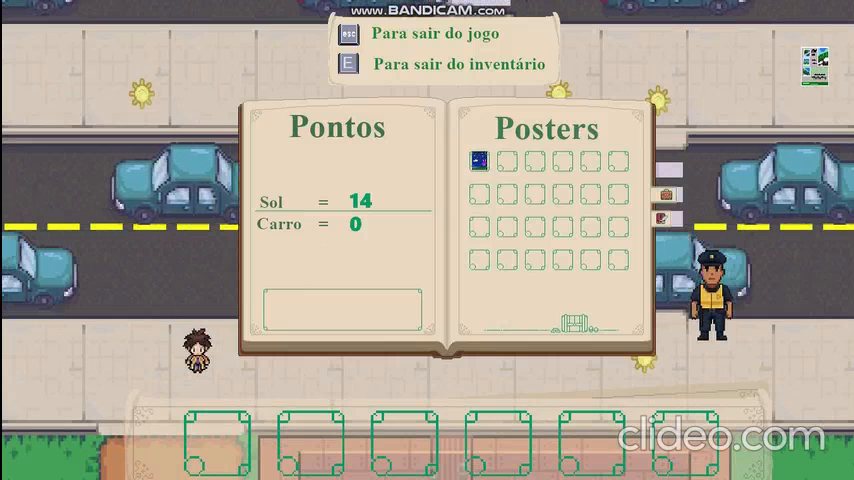
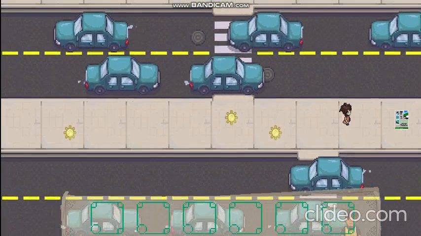
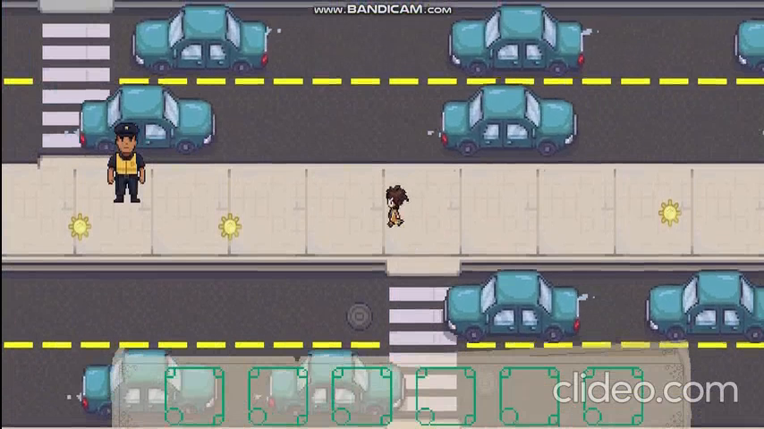

# 🛑 SignalSafe: Um Jogo Sério para Educar no Trânsito 🚗

> Projeto de TCS - Faculdade Senac Joinville  
> Curso de Tecnologia em Análise e Desenvolvimento de Sistemas

---

## 🛠️ Instalação

1. Acesse a aba **Releases** do repositório.
2. Baixe o arquivo `SignalSafe.exe`.
3. Execute o arquivo no Windows (pode ser necessário permitir a execução se o SmartScreen alertar).
4. Não é necessária instalação: o jogo é portátil e roda direto.

---

## 🌟 Apresentação do Projeto

O **SignalSafe** é um jogo educativo digital desenvolvido como Trabalho de Conclusão de Semestre (TCS) por alunos da Faculdade Senac Joinville. Seu foco é promover **educação para o trânsito** de forma lúdica e significativa, visando à formação cidadã consciente desde a infância.

Inspirado por dados alarmantes sobre acidentes envolvendo crianças no trânsito e pela ausência de conteúdo estruturado sobre o tema no Ensino Fundamental I, o projeto se propõe a ser uma ferramenta pedagógica eficaz, utilizando a linguagem dos jogos digitais para ensinar sobre segurança viária.

---

## 🚫 Justificativa

Apesar de sua importância, a educação para o trânsito é tratada como conteúdo transversal na BNCC, o que dificulta sua inserção sistemática no currículo escolar. Dados do Sistema de Informações sobre Mortalidade do SUS (SIM/SUS) mostram que o trânsito é a principal causa de morte acidental entre crianças de até 14 anos no Brasil.

Muitas dessas ocorrências estão ligadas ao desconhecimento de regras básicas de circulação, à falta de percepção de risco e à ausência de autonomia segura por parte das crianças. O uso de jogos sérios como ferramenta de educação se mostra promissor ao tornar a aprendizagem mais envolvente, segura e contextualizada.

---

## 🎯 Objetivos

### Objetivo Geral

Desenvolver um jogo digital educativo voltado à educação para o trânsito de crianças entre 9 e 11 anos, promovendo a compreensão de normas, comportamentos seguros e responsabilidade cidadã.

### Objetivos Específicos

- Realizar revisão bibliográfica e entrevistas com professores;
- Levantar requisitos pedagógicos e técnicos;
- Desenvolver uma interface acessível e atrativa;
- Simular situações urbanas reais de forma interativa;
- Realizar testes com usuários e ajustes baseados em feedback;
- Avaliar os resultados quanto a engajamento, usabilidade e aprendizagem.

---

## 🧩 Mecânicas e Funcionalidades

- Simulação de travessias, semáforos, placas e riscos reais;
- Diálogos com NPCs (mãe, guarda de trânsito);
- Pontuação por ações corretas ou penalização por erros;
- Inventário e HUD com feedbacks claros;
- Narrativas contextualizadas com voz e texto;
- Uso de FSM (Finite State Machine) para comportamentos previsíveis;
- Design em pixel art, com ambientação urbana familiar à criança.

---

## 🌍 Fundamentação Teórica

O SignalSafe foi concebido com base em referenciais como:

- **BNCC e CTB** para fundamentação legal e pedagógica;
- **Aprendizagem ativa e lúdica**, que valoriza o protagonismo infantil;
- **Gamificação e feedback imediato** para retenção de conteúdo;
- **Design instrucional em jogos sérios**, com desafios progressivos;
- **TDICs** (Tecnologias Digitais de Informação e Comunicação) no contexto escolar.

---

## 🕹️ Como Jogar

Você controla uma criança em uma missão cotidiana: ir ao mercadinho a pedido da mãe. No trajeto, deve:

- Aguardar semáforo de pedestres
- Identificar placas como "Pare" e "Travessia Escolar"
- Evitar atravessar fora da faixa
- Recolher itens e ganhar pontos por boas ações
- Usar passarelas e respeitar o ambiente urbano

---

## 🏫 Aplicação na Escola

O jogo pode ser integrado às aulas com mediação do professor, sendo utilizado para:

- Oficinas de cidadania
- Projetos multidisciplinares (Português, Geografia, Ed. Física)
- Atividades de reforço em datas como a Semana Nacional do Trânsito

---

## 🔁 Propostas Futuras

- Versão mobile para Android/iOS
- Painel para acompanhamento pedagógico
- Recursos de acessibilidade (Libras, audiodescrição)
- Novos desafios e cenários realistas
- Integração com programas públicos de educação para o trânsito

---

## 👨‍💻 Equipe de Desenvolvimento

Projeto desenvolvido por:

- Davi Finkler
- Fabricio Cavalcante Correia
- José Carlos Reche
- William Cardoso Hobold
- Willian Ramos Wilgen

**Orientador:** Prof. Gabriel Caixeta Silva

---

## 📅 Ano e Instituição

Faculdade Senac Joinville  
Curso de Tecnologia em Análise e Desenvolvimento de Sistemas  
Ano: **2025**

---

## ✨ Licença

Este projeto está licenciado sob a Licença MIT. Consulte o arquivo `LICENSE` para mais informações.

---

> “Atravessar com segurança é só o começo. Educar para o trânsito é formar cidadãos para a vida.”
